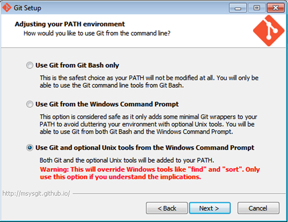

---
## Local Development Setup for Chef
---

### Download and install

[chef-dk](http://www.getchef.com/downloads/chef-dk)

[virtual box](https://www.virtualbox.org/wiki/Downloads)

[vagrant](http://www.vagrantup.com/downloads.html)

[sublime text (optional)](http://www.sublimetext.com/2)

#### Windows users will need to install git

[git](http://git-scm.com/download/win)

On the screen below make sure to choose 'Use Git and optional Unix tools from the Windows Command Prompt'



### Test install
`knife -v && chef -v && git --version`

---
## Local cookbook development workflow
---

### create new cookbook using Berkshelf
`chef generate pipeline`

### change directory to new cookbook
`cd pipeline`

### add jenkins dependency to metadata.rb
```
name             'pipeline'
maintainer       'YOUR_NAME'
maintainer_email 'YOUR_EMAIL'
license          'All rights reserved'
description      'Installs/Configures pipeline'
long_description 'Installs/Configures pipeline'
version          '0.1.0'

depends          'java'
depends          'jenkins'
```

### add jenkins::java included recipe to recipes/default.rb
```
#
# Cookbook Name:: pipeline
# Recipe:: default
#
# Copyright (C) 2014 YOUR_NAME
#
# All rights reserved - Do Not Redistribute
#

include_recipe 'java::default'
```

### Add jenkins to recipes/default.rb to create a jenkins master
```
#
# Cookbook Name:: pipeline
# Recipe:: default
#
# Copyright (C) 2014 YOUR_NAME
#
# All rights reserved - Do Not Redistribute
#

include_recipe 'java::default'
include_recipe 'jenkins::master'
```

### Modify .kitchen.yml to configure port forwarding, cpu/memory settings, update platform to centos-6.5, and set default recipe and attributes
```
driver:
  name: vagrant

driver_config:
  network:
  - ["forwarded_port", {guest: 8080, host: 8080}]
  - ["private_network", {ip: "33.33.33.10"}]
  customize:
    memory: 2048
    cpus: 2

provisioner:
  name: chef_zero

platforms:
  - name: centos-7.0

suites:
  - name: default
    run_list:  
      pipeline::default
    attributes:
```

### Show all kitchen instances
`kitchen list`

### Run VM for CentOS and converge with configuration
`kitchen converge centos`

### See if jenkins is running
`http://localhost:8080`

### see git status of files added and modified
`git status`

### add all files
`git add .`

### commit all changes
`git commit -m "initial commit of pipeline cookbook"`


## Links to example cookbook
[Pipeline Cookbook Example](https://github.com/stephenlauck/setup_local_chef_dev_pipeline)
